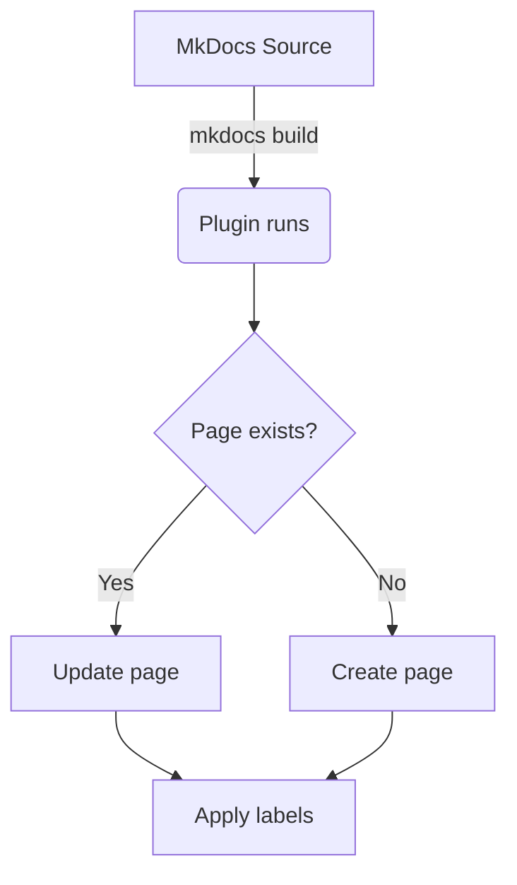
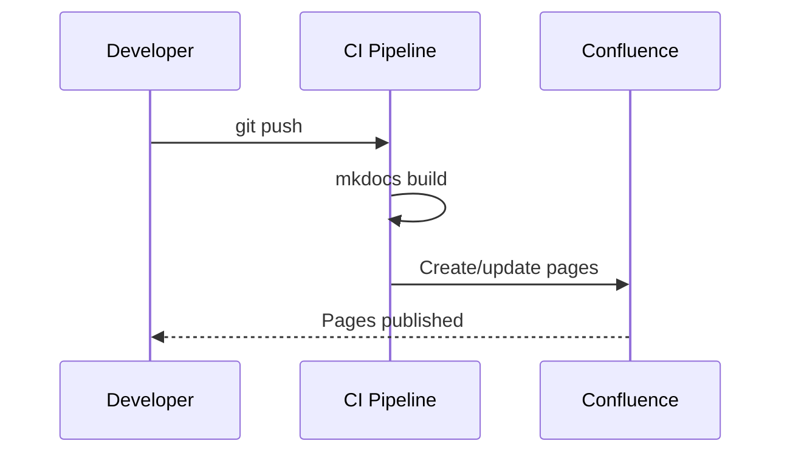

# Code Blocks & Syntax Highlighting

Fenced code blocks are converted to the Confluence **code** macro, which
provides syntax highlighting, line numbers toggle, and a copy button.

## Python

```python
def fibonacci(n: int) -> list[int]:
    """Return the first *n* Fibonacci numbers."""
    a, b = 0, 1
    result = []
    for _ in range(n):
        result.append(a)
        a, b = b, a + b
    return result
```

## Shell / Bash

```bash
# Deploy to production
mkdocs build
PUBLISH_TO_CONFLUENCE=1 mkdocs build
```

## YAML (config example)

```yaml
plugins:
  - mkdocs-confluence:
      host_url: https://yourorg.atlassian.net/wiki/rest/api/content
      space: ENG
      parent_page_name: Docs
      enable_header: true
      toc: true
```

## JSON

```json
{
  "name": "mkdocs-confluence-plugin",
  "version": "1.0.0",
  "features": ["admonitions", "code-blocks", "mermaid", "tabs"]
}
```

## Plain (no language)

```
This block has no language specified.
It renders without syntax highlighting.
```

## Mermaid diagrams

Mermaid blocks are sent to the Confluence **mermaid** macro (requires the
Mermaid for Confluence app on your instance).




