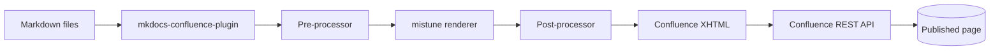
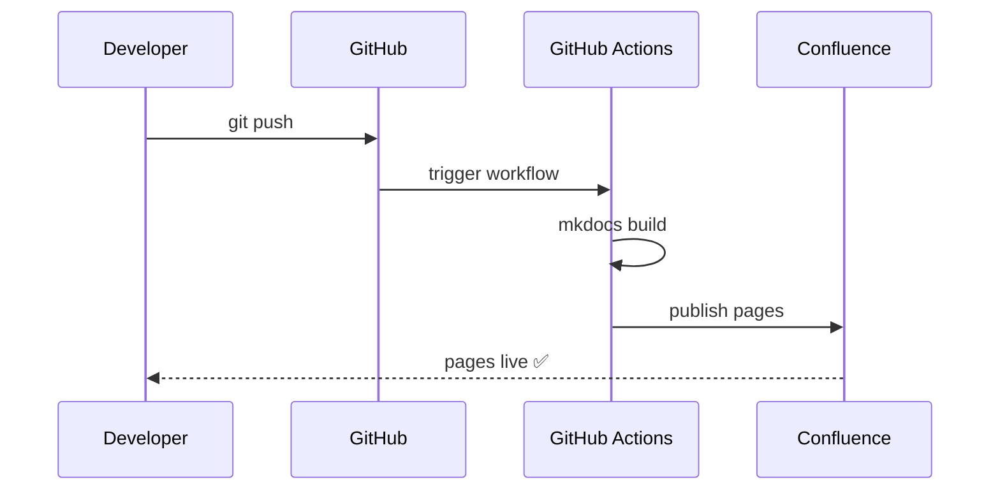

# Confluence Rendering Showcase {#top}

This page demonstrates every Markdown feature the `mkdocs-confluence-plugin`
translates into native Confluence macros. Each section shows the Markdown
source and its rendered output.

---

## Admonitions {#admonitions}

Standard admonitions map to Confluence **info / note / tip / warning** macros.

!!! info "What are admonitions?"
    Admonitions highlight important information. The plugin maps MkDocs Material
    admonition types to the four native Confluence callout macros automatically.

!!! tip "Pro tip"
    Use `tip` for best-practice advice and shortcuts that save time.

!!! note "Worth knowing"
    Use `note` or `seealso` for supplementary context that readers shouldn't miss.

!!! warning "Proceed with caution"
    Use `warning`, `caution`, or `attention` before anything with side-effects.

!!! danger "Stop — read this first"
    `danger` and `error` map to the **warning** macro with a red icon. Use for
    irreversible actions: data deletion, production deploys, credential rotation.

---

## Collapsible Sections {#collapsible}

`???` renders as a Confluence **Expand** macro — collapsed by default.
`???+` renders expanded by default.

??? note "Why use collapsible sections?"
    Collapsible sections keep long pages scannable. Readers can reveal detail
    on demand without losing their place.

    They're ideal for:

    - Verbose configuration examples
    - Rollback procedures
    - Extended reference tables

???+ tip "This one starts open"
    Use `???+` when the content is important but still benefits from visual
    separation from the main flow.

---

## Code Blocks {#code-blocks}

Fenced code blocks become Confluence **Code** macros with syntax highlighting.

```python
from mkdocs_confluence_plugin import ConfluencePlugin

plugin = ConfluencePlugin()
rendered = plugin.confluence_mistune("## Hello Confluence")
print(rendered)
```

```bash
# Deploy the service
docker build -t myapp:latest .
docker push registry.example.com/myapp:latest
kubectl rollout restart deployment/myapp
```

```yaml
# mkdocs-confluence.yml
plugins:
  - confluence:
      host_url: https://your-org.atlassian.net/wiki/rest/api/content
      space: DOCS
      parent_page_name: Engineering Hub
      enabled_if_env: MKDOCS_TO_CONFLUENCE
```

```sql
-- Add column without locking the table
ALTER TABLE users
  ADD COLUMN preferred_name VARCHAR(255);

-- Backfill asynchronously
UPDATE users
SET preferred_name = display_name
WHERE preferred_name IS NULL;
```

```json
{
  "service": "payment-gateway",
  "version": "4.1.0",
  "environment": "production",
  "features": ["3ds2", "recurring-billing"]
}
```

---

## Mermaid Diagrams {#mermaid}

Fenced ` ```mermaid ` blocks become the Confluence **Mermaid** macro.





---

## Tabs {#tabs}

`=== "Tab name"` blocks become **Expand** macros, one per tab.

=== "pip"

    ```bash
    pip install mkdocs-confluence-plugin
    ```

=== "uv"

    ```bash
    uv add mkdocs-confluence-plugin
    ```

=== "poetry"

    ```bash
    poetry add mkdocs-confluence-plugin
    ```

---

## Task Lists {#task-lists}

`[x]` becomes ✅ and `[ ]` becomes ☐ in Confluence (which doesn't have native task-list syntax).

**Release checklist**

- [x] Tests passing on CI
- [x] Version bumped in `pyproject.toml`
- [x] CHANGELOG updated
- [x] PyPI release published
- [ ] Confluence pages republished
- [ ] Stakeholders notified

---

## Definition Lists {#definition-lists}

Definition lists render as `<dl>/<dt>/<dd>` HTML, preserved in Confluence storage format.

Admonition
:   A styled callout block introduced by `!!!` or `???`. Maps to a Confluence
    structured macro (`info`, `note`, `tip`, or `warning`).

Storage format
:   The XHTML dialect Confluence uses internally to represent page content.
    The plugin outputs valid storage format XML for every Markdown feature.

Dryrun mode
:   When `dryrun: true` is set, the plugin processes all pages and logs what
    would be published, but makes no API calls.

---

## Heading Anchors {#heading-anchors}

Append `{#anchor-id}` to any heading to insert a Confluence **Anchor** macro,
enabling deep links from other pages.

### Deployment steps {#deployment-steps}

You can link directly to this heading with:
`[Deployment steps](this-page#deployment-steps)`

---

## Table of Contents {#toc}

Setting `toc: true` in page frontmatter inserts the Confluence **Table of
Contents** macro at the top of the page body.

```yaml
---
title: My Long Page
toc: true
---
```

---

## Page Properties {#page-properties}

Setting `confluence_properties` in frontmatter wraps the key/value pairs in the
Confluence **Page Properties** macro, making the data queryable via the
Page Properties Report macro.

```yaml
---
confluence_properties:
  Owner: Platform Engineering
  Status: Live
  Category: Documentation
  Last Reviewed: 2026-06-28
---
```

This page uses that frontmatter — the properties table appears at the top in Confluence.

---

## Page Properties Report {#page-properties-report}

Setting `confluence_page_properties_report` in frontmatter inserts the
**Page Properties Report** macro, which aggregates property tables from all
pages with a given label into a live queryable table.

```yaml
---
confluence_page_properties_report:
  label: change-management
  headings:
    - Change ID
    - Date
    - Risk
    - Status
  sort_by: Date
  max: 100
---
```

See [Forward Calendar of Change](changes/change-calendar.md) for a live example.

---

## Regular Tables {#tables}

Standard Markdown tables pass through mistune and render correctly in Confluence.

| Feature | Markdown syntax | Confluence macro |
|---|---|---|
| Info admonition | `!!! info` | `info` |
| Warning admonition | `!!! warning` | `warning` |
| Tip admonition | `!!! tip` | `tip` |
| Note admonition | `!!! note` | `note` |
| Collapsible | `??? note` | `expand` |
| Code block | ` ```lang ` | `code` |
| Mermaid diagram | ` ```mermaid ` | `mermaid` |
| Tabs | `=== "Tab"` | `expand` (per tab) |
| Heading anchor | `## Heading {#id}` | `anchor` |
| TOC | `toc: true` frontmatter | `toc` |
| Page Properties | `confluence_properties:` | `details` |
| Properties Report | `confluence_page_properties_report:` | `detailssummary` |

---

[↑ Back to top](#top)
